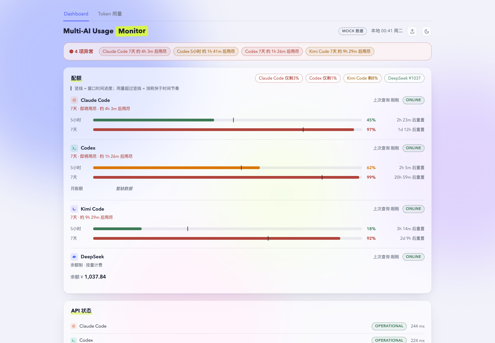
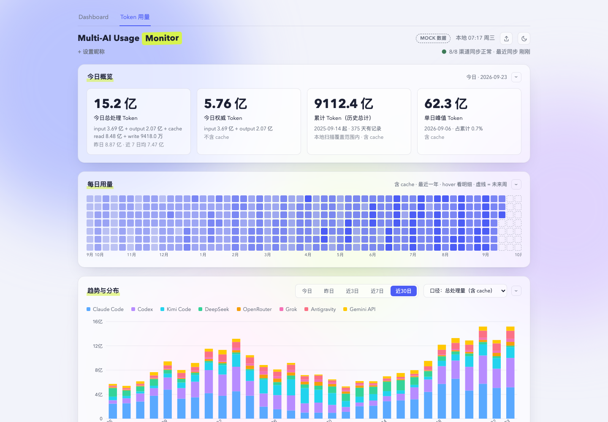

# api-usage-board — AI API 用量监控 Dashboard

深/浅双主题监控台，一屏看完 **8 个 AI 编程工具/API 渠道**的配额、token 用量和费用：
Claude Code / Codex / Kimi Code / DeepSeek / OpenRouter / Grok / Cursor / Antigravity。

纯前端 vanilla HTML/CSS/JS（ES modules），无构建步骤、无外部依赖、无 CDN；本地 server
只用 Node 内置模块，零 npm 依赖。数据全部读取你本机已有的 CLI 凭证/日志，**不上传任何数据**。

> 产品原型借鉴自[这篇微信文章](https://mp.weixin.qq.com/s/9IQzxijlbDdLiAiS8np5aQ)，
> 供开发学习和自用。




## 快速开始

**1. 前置条件**：Node ≥18。

**2. 克隆并启动**：

```bash
git clone https://github.com/isalicema/api-usage-board.git
cd api-usage-board
./serve.command
```

浏览器打开 `http://127.0.0.1:8177`。

**3. 看懂第一屏**：**你电脑上装了哪个 AI 工具，对应渠道就自动亮起**——这些工具登录后都会
在本地留一份凭证文件，这个 dashboard 只是读它们，不需要你额外配置。没装的渠道显示灰色
「未配置」/「未运行」，不影响其他渠道，**不需要凑齐 8 个才能用**。

**4.（可选）配置 OpenRouter**：唯一一个需要手动配置的渠道（不是本地 CLI 工具）。
Dashboard 页面 OpenRouter 卡片未配置时会显示「未配置 key → 如何获取 key」，点一下就有
分步说明。不用的话直接忽略。

**5.（可选）设置订阅套餐**：切到「Token 用量」tab 底部「费用预估与套餐回报」面板，
每个渠道套餐旁边是下拉选择框，选完立刻生效，**不需要手改配置文件**。

## 功能一览

- **Dashboard**：每渠道配额进度条 + 用尽预警横幅（按消耗速度外推还有多久用尽）+ 状态徽标
  （ONLINE / STALE / OFFLINE / NO KEY / 未运行）
- **Token 用量**：今日概览、一年视图热力图、趋势堆叠图、Coding Agent / 模型 / 项目三个
  分布面板、费用预估与订阅 ROI
- 深/浅主题切换、server 没起时自动回退示意数据（不会白屏）

## 配置文件

| 文件 | 内容 | 说明 |
|---|---|---|
| `server/.env` | `OPENROUTER_MANAGEMENT_KEY=sk-or-...` | `cp server/.env.example server/.env` 后填真实 key，建议 `chmod 600 server/.env` |
| `server/config.json` | `projectAliases` / `modelPrices` / `subscriptions` / `cnyUsdRate` | mtime 热加载，改完不用重启。`subscriptions` 可以在页面上选，不用手改文件；`projectAliases`/`modelPrices` 仍需手改，`modelPrices` 是占位刊例价，请按官方价格页核实 |

## 已知限制

- Claude/Codex 的配额直连走的是未公开接口（跟随官方客户端行为），可能随时漂移；都有降级链（直连失败→旧方案→offline），不会直接报错
- Antigravity 凭证位置未定位，只能在 agy 运行时机会主义采集；不跑则显示"未运行"
- Grok 的 token 序列是上下文快照近似值，不是精确计量
- Cursor / Antigravity 没有本地干净日志，不进 Token 用量 tab

## 安全

- key/token 只进 server 进程内存，绝不出现在 API 响应、日志、前端里
- server 只绑 `127.0.0.1`；静态服务拒绝一切 dotfile 路径（`server/.env` 经 HTTP 不可读）
- `/api/*` 出错不透出内部细节

更详细的技术实现（各渠道具体接口/凭证路径、缓存策略、验证脚本）见 [`docs/ARCHITECTURE.md`](docs/ARCHITECTURE.md)。

## License

MIT（如需修改请自行调整 `LICENSE` 文件）。
